# Đồ án tốt nghiệp năm học 2025
## Đề tài: Phần mềm xuất bản sách trực tuyến bằng Angular và .NET 9
## Trường đại học Thủy Lợi


### Sinh viên thực hiện: Lê Khắc Ninh
### Mã sinh viên: 2151062844
### Khóa: K63


##
## Giới thiệu
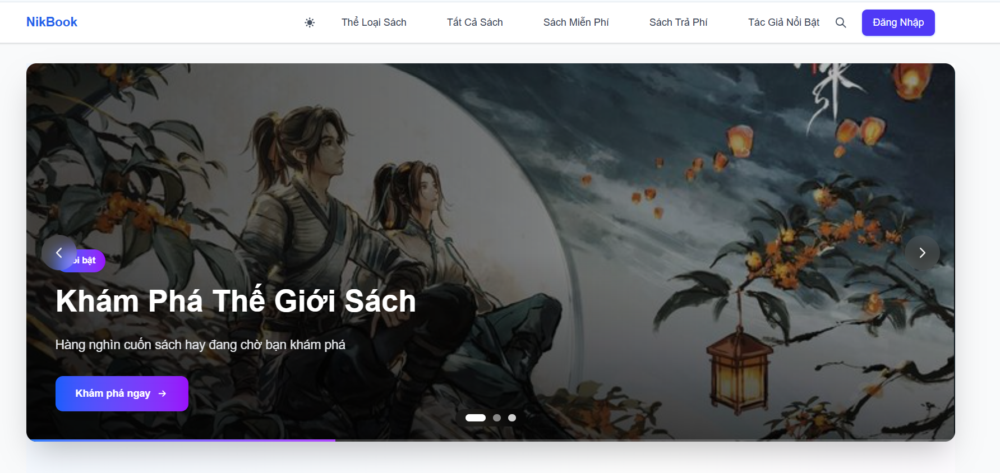
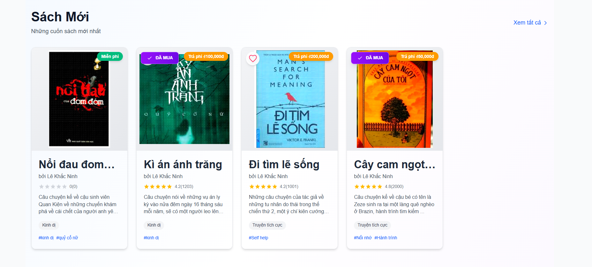

[![Xem video]](images/2025-07-03%2011-37-23.mkv)


## Kiến trúc phần mềm
Phần mềm là ứng dụng nguyên khối (monolithic) được chia thành các 
bound context có bối cảnh, lĩnh vực khác nhau bên trong
hệ thống theo cách thức tiếp cận theo miền (Domain Drive Design)
Kiến trúc phần mềm mã nguồn

Cách tổ chức mã nguồn hay kiến trúc phần mềm được
xây dựng dựa trên Clean Architecture và các khái niệm về Module


Solution được chia thành các lớp có nhiệm vụ và các tiếp cận khác nha
- Domain Layer: Nhân của hệ thống, thứ làm nên sự khác biệt cho doanh nghiệp, nơi chứa toàn bộ các business logic của hệ thống, đây là nơi mà mọi người ngồi xuống và nói những khái niệm kinh doanh cốt lõi của dự án và có một ngôn ngữ chung mô hình hóa các kiến
thức về miền cho các bên cùng tìm ra sự thống nhất về miền, và ở miền không có bất kì một sự phụ thuộc nào đến các lớp khác hhay các dịch vụ bên ngoài 
- Application Layer: Đây là một use case dùng để 
điều phối các tương tác của người dùng đến các bussiness logic tương ứng
- Infrastructure: Hạ tầng của ứng dụng chứa các dịch vụ bên ngoài cần thiết cho quá trình hoạt động của ứng dụng

### CQRS Pattern
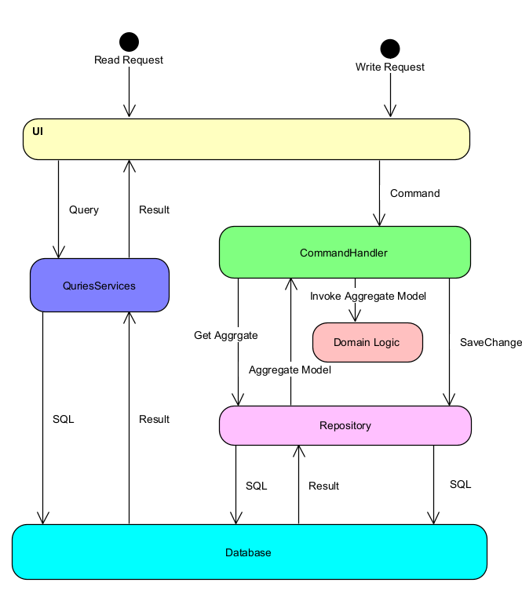

Hệ thống sử dụng CQRS Pattern ở Application Layer để điều phối các usecase đến các Aggregate,và Read Models khác nhau để tối ưu 
hóa cho quá trình đọc ghi và khả năng mở rộng của dự án. Tránh trường hợp sử dụng services với rất nhiều method làm cho ứng dụng trở 
nên khó mở rộng và khó đọc, việc tách các thao tác của đọc và ghi này nó cũng tuân làm và tuân thủ theo các nguyên tắc thiết kế phần mềm như
Single Responsibility Principle một lớp chỉ nên có duy nhất một lý do để mà thay đổi tức là nó chỉ quan tâm đến một vấn đề của usecase

Open/Closed Principle Các phần trong phần mềm nên hướng đến sự mở rộng khi tính năng tăng lên chứ không phải là tăng lên về số chức năng cần sửa lại

Dự án có hỗ trợ Slave Master Architecture đề có thể tối ứu hóa trong các trường hợp muốn mở rộng

Bạn cũng có thể tách các thao tác đọc bằng cách sử dụng một ORM khác như Dapper để tối ưu hóa các thao tác đọc và truy vấn nâng cao vơi SQL thô

### Mediator Pattern
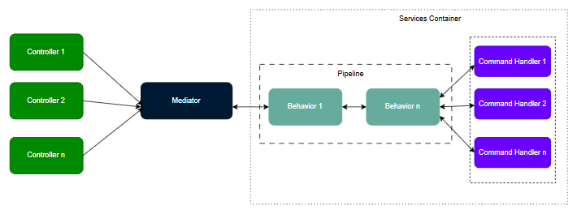

Cái vấn đề của CQRS là sự phình to về chiểu ngang của solution và việc quản lý Dependency đôi khi làm rối mã nguồn và khó quản lý

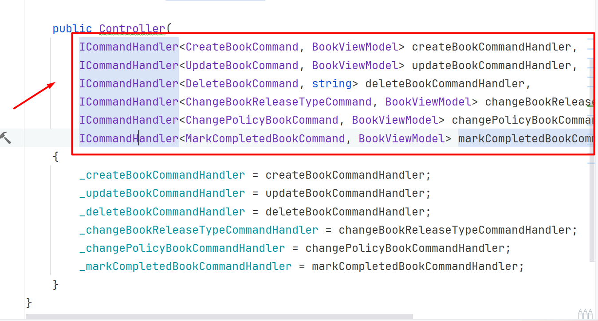

Việc inject này đôi khi gây ra trở ngại cho việc triển khai CQRS khi chúng ta có thể có tới hàng chục các Command Handler và các dịch vụ khác cần Inject

Mediator Pattern giúp giải quyết vấn đề này bằng cách tạo ra một khối "black box" hay người ở giữa để có thể điều phố Controller tới các Handler tương ứng
và lợi ích khác của Mediator là việc chung ta tích hợp các behavior vào sau mediator để tạo pipe line của ứng dụng bằng cách khi Mediator nhận được yêu cầu xử lý Handle
nó phải tạo và xử lý các behavior trước đấy

Pipeline khi tích hợp với Mediator

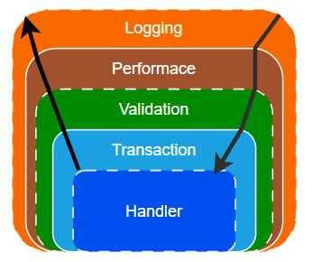


Tại sao không dùng ServicesCollection của MS mà lại tự build cái này ; Tại sao không dùng Middleware hay Filter

### Class Diagram
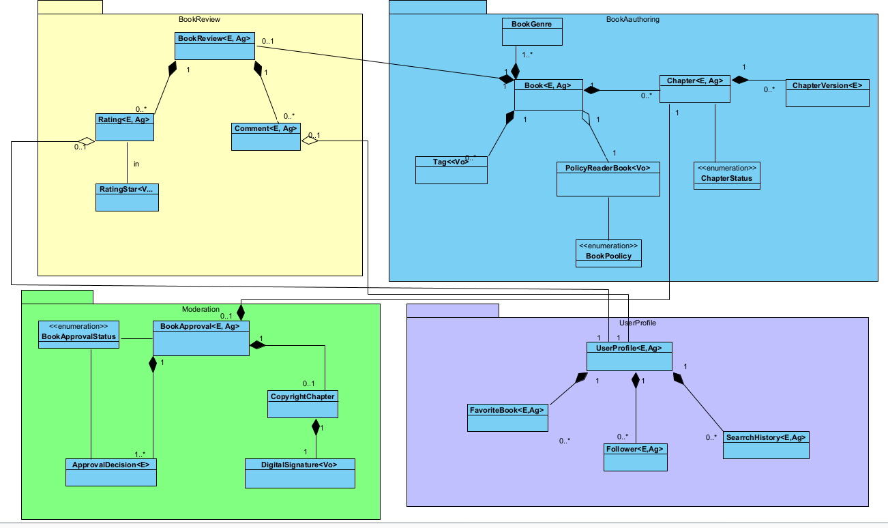

### Context và cách thức tương tác trong hệ thống
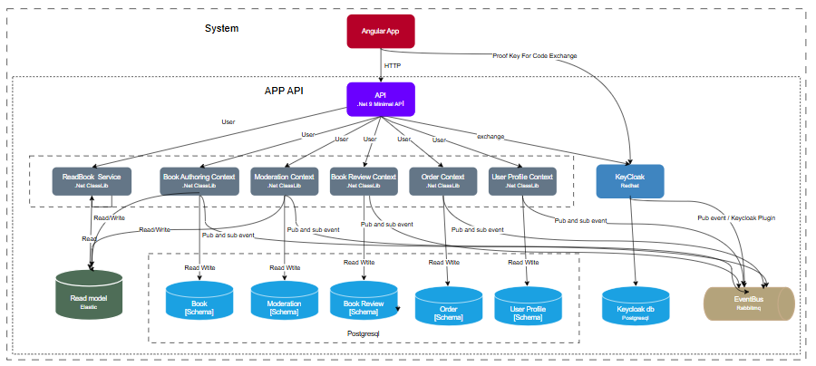

### Tương tác giữa các layer trong các context
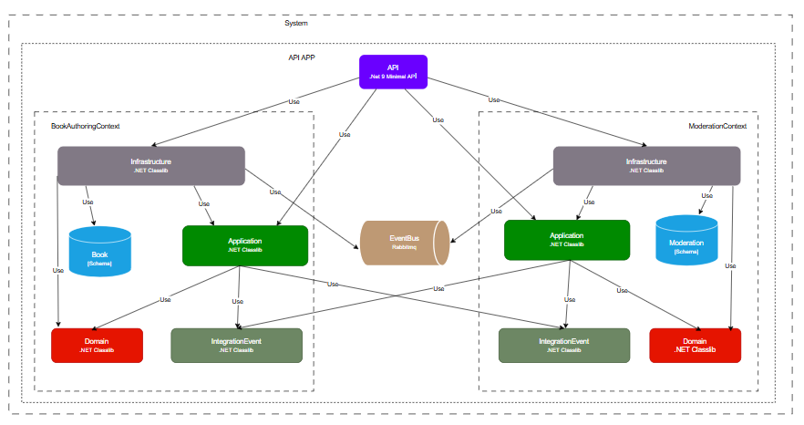

##  Luồng tuần tự của dữ liệu
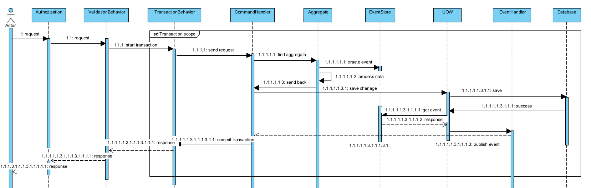


## Cách cài đặt
Môi trường yêu cầu 
- [.NET 9](https://dotnet.microsoft.com/en-us/download/dotnet/9.0)
- [Docker](https://docs.docker.com/desktop/)
- [Angular 19](https://angular.dev/installation)

Đảm bảo Docker Desktop chạy trước khi cài đặt

#### Clone dự án
```gitexclude
git clone https://github.com/Nik211885/do-an-tot-nghiep.git
```
Cài đặt cái dịch vụ liên quan qua Docker

Mở folder vừa clone về chọn vào file .env và sửa các thông số cấu hình cho các dịch vụ 

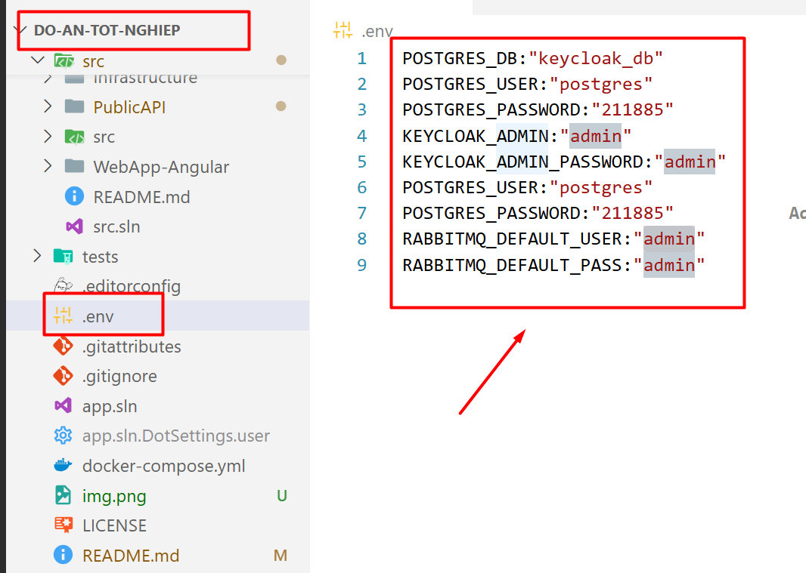

Điền các thông tin cho các dịch vụ trước khi chạy

Mở terminal tại solution 
```
docker compose up
```

Cài đặt các package cho ứng dụng fontend

Vào thư mục WebApp-Angular 

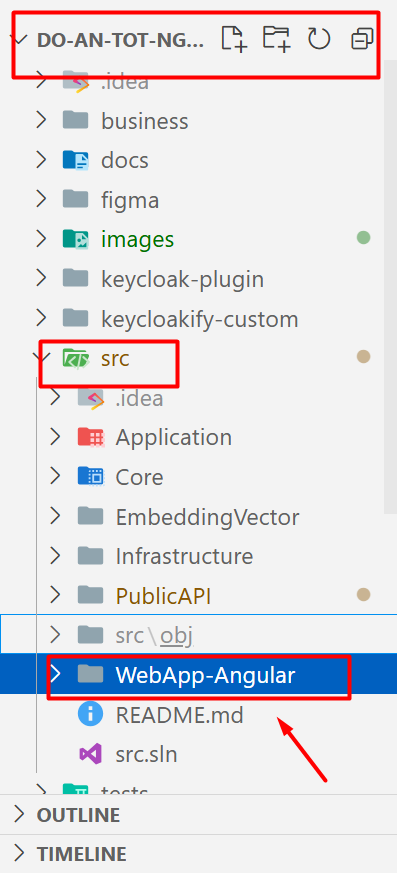

Mở terminal tại folder này và cài đặt các package cần cho dự án

```
npm install
```

Sau khi cài xong các gói chạy ứng dụng 
```
ng serve
```

Cấu hình các thông số cho backend 
Vào folder PublicAPI mở file appsetting.json ở đây chứa toàn bộ thông tin cấu hình của ứng dụng

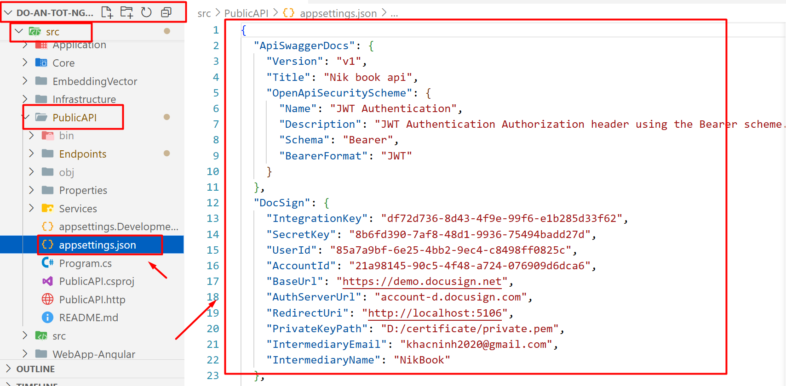

Các thông số cấu hình của ứng dụng bao gồm 
- [DocSign](https://www.docusign.com/): Dùng để kí số cho các tác phẩm sau duyệt
- MailSetting 
- [UploadFile](https://cloudinary.com/): Thông tin cấu hình để upload file lên Cloudinary
- [MoMoConfig](https://developers.momo.vn/v3/docs/payment/guides/home) Thông tin doanh nghiệp đã đăng kí với MoMo

Cấu hình với Master-Slave Architecture dự án cho phép bạn chuyển đổi sang mô hình master slave với thuật toán round-robin để phân phối các yêu cầu đến các database
Ứng dụng chỉ hỗ trợ với hệ quản trị cơ sở dữ liệu PostgreSQL

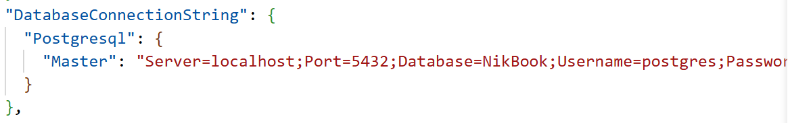

Bạn có thể thêm nhiêu các master và slave database vào cấu hình

Migrations

```
dotnet ef database update --project Infrastructure --startup-project PublicAPI
```

Chạy ứng dụng

``
dotnet run --project PublicAPI``

## Công nghệ sử dụng
[.NET 9](https://dotnet.microsoft.com/en-us/download/dotnet/9.0)

[Angular 19](https://angular.dev/installation)

[KeyCloak](https://www.keycloak.org/)

[Redis](https://redis.io/)

[Rabbitmq](https://www.rabbitmq.com/)

[ElasticSearch](https://www.elastic.co/elasticsearch)

## Giấy phép
Dự án thuộc giấy phép MPL-2.0 license
## Người đóng góp


## Tài liệu tham khảo

