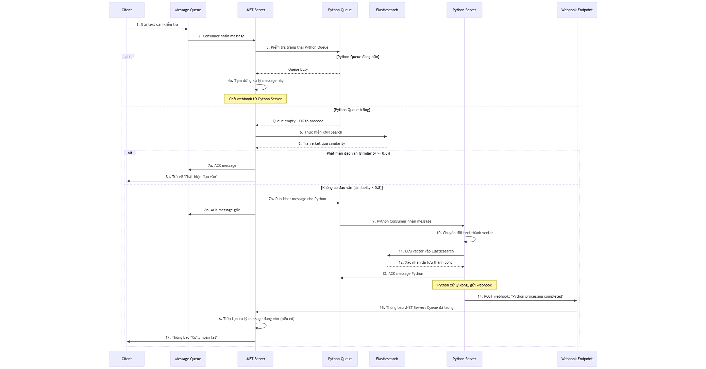

# Đồ án tốt nghiệp năm học 2025
## Đề tài: 
## Trường đại học Thủy Lợi
### Sinh viên thực hiện: Lê Khắc Ninh
### Mã sinh viên: 2151062844
### Khóa: K63

## Kiến trúc phần mềm

## Luồng dữ liệu 
### Biểu đồ tuần tự cho quá trình duyệt sách tự động

## Cách cài đặt

## Công nghệ sử dụng

## Giấy phép

## Người đóng góp
- Chat GPT
- Claude Ai
- Trong dự án này 90% code fontend là nhờ chat bot, việc không tối ưu cho các thao tác của người dùng có thể xảy ra, nhưng trên hết tôi nghĩ điều đấy ổn, cho người không rõ các công nghệ fontend như tôi, do thời gian làm có hạn nên việc refact lại chắc là một thời gian sau,
- Bạn có nghĩ các vấn đề về AI khi nó có thể làm hầu như các thao tác của một số lập trình viên, trong khoảng từ 1-3 năm kinh nghiệm ít nhất là ở thời điểm hiện tại. Không chắc, mọi thứ rồi phát triển theo chiều hướng nào nữa nhưng việc tiếp tục là không thể dừng lại, có thể là một new path

## Tài liệu tham khảo
